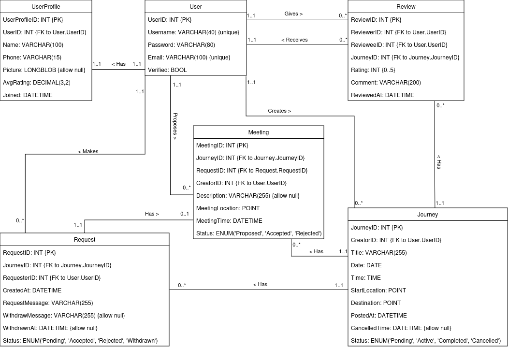

# Rigshaw

Rough implementation of Rigshaw scenario UML db design for ATU CA2, using Django. Very basic for now, just testing if the database would work.

Some changes have been made to simplify implementation:

- Using Django's default sqlite database rather than MySQL
- "Verified" is not present on the User object. Using default User model and django-allauth, so relying on Allauth's email verification to handle verification of a user rather than customising the default model
- Not using GeoDjango so don't have access to PointFields, using separate lat and long DecimalFields for storing locations. There is a Leaflet package that apparently works well with GeoDjango but I haven't used either before and didn't want to go down a rabbit hole of new packages. Maybe later, could be nicer to work with
- (Not sure of the best way to handle the notifications for requests and things yet.)

### Usage

- Clone or fork repository
- Install requirements
- Add an env.py and environment variables (though nothing really sensitive here, just habit)
- Can use the default database or delete and create/link your own
- Registering a user for now prints the email to the terminal so follow that link to verify

### Leaflet

Just using the a cdn for Leaflet right now, but there's a [Django Leaflet](https://pypi.org/project/django-leaflet/) package which works with [GeoDjano](https://docs.djangoproject.com/en/5.1/ref/contrib/gis/) quite well apparently, so noting here to try later
